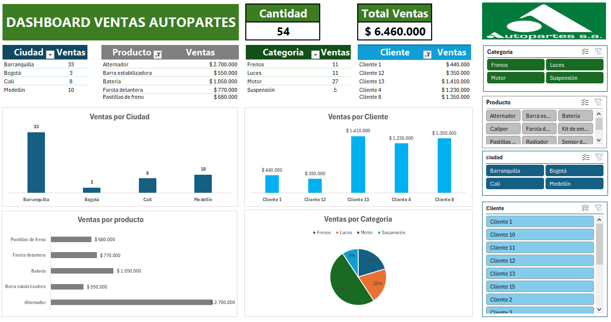
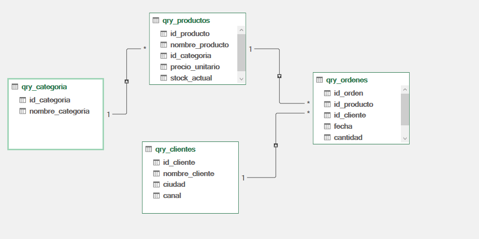

# 📊 Dashboard de Ventas – Autopartes

Este proyecto simula el análisis de ventas de una empresa de autopartes usando **Excel avanzado**: Power Query + Power Pivot. Está diseñado como parte de un portafolio profesional que muestra manejo de limpieza de datos, modelo de datos y visualización.

---

## 🧩 Estructura de Archivos

- `productos.xlsx`
- `clientes.xlsx`
- `ordenes_compra.xlsx`
- `categorias.xlsx`
- `dashboard_autopartes.xlsx` – archivo final con Power Pivot y dashboard
- `Dashboard.PNG` – captura final del tablero
- `Modeloestrella.PNG` – relaciones establecidas

---

## 🛠️ Proceso Paso a Paso

### 1. Carga y limpieza de archivos con Power Query

Se importaron **cuatro archivos** (categorías, clientes, productos, órdenes) utilizando el siguiente flujo:

- Power Query → Importar **una por una**
- Se seleccionó cada archivo de Excel
- Opción: `Transformar datos` en lugar de `Cargar directo`
- Se configuraron los pasos de limpieza:
  - Primera fila como encabezados
  - Validación de tipos de datos
  - Cargar como: **Solo conexión + Modelo de datos**

---

### 2. Modelo Estrella con Power Pivot

Una vez cargadas las tablas:

- Se ingresó al Editor de Power Pivot
- Se establecieron relaciones entre:
  - `ordenes` con `clientes` (id_cliente)
  - `ordenes` con `productos` (id_producto)
  - `productos` con `categorias` (id_categoria)

Esto genera un **modelo estrella**, ideal para análisis y DAX.

---

### 3. Medidas DAX implementadas

Se crearon medidas en Power Pivot como:

- **Total Ventas**: `=SUMX(qry_ordenes, qry_ordenes[cantidad] * RELATED(qry_productos[precio_unitario]))`
- **Cantidad Total**: `=SUM(qry_ordenes[cantidad])`

Estas medidas se usaron en tarjetas y gráficos.

---

### 4. Visualización en el Dashboard

El dashboard incluye:

- KPI: Total Ventas, Cantidad Total
- Gráficos: Ventas por Ciudad, Cliente, Producto y Categoría
- Segmentadores dinámicos (slicers)
- Diseño profesional, limpio y ordenado

---

## 🧠 Tip Técnico – Carga profesional con Power Query

Durante el proyecto, se usó una técnica eficiente para cargar los datos:

✅ **MÉTODO USADO: Duplicar consultas y modificar solo el origen**

### 🔁 Pasos realizados:

1. Duplicar consulta previa (`qry_ordenes`)
2. Renombrar a `qry_productos`, `qry_clientes`, etc.
3. Eliminar pasos excepto `Origen`
4. Clic en campo Binary → Table
5. Usar primera fila como encabezado
6. Ajustar tipos de datos
7. Cargar como: Solo conexión + Modelo

### 🎯 Ventajas:

- Ahorra tiempo y mantiene consistencia
- Ideal para manejar archivos Excel sin formato de tabla estructurada
- Muy útil en pruebas o casos empresariales

---

## 📝 Recomendaciones Finales

- Usar siempre Power Query para transformar datos antes de usar tablas dinámicas
- Power Pivot te permite manejar modelos relacionales directamente en Excel
- No mezcles datos en hojas visibles; mantén todo en el modelo de datos

---

## 📁 Capturas del Proyecto

### 📊 Capturas del Proyecto

---

## 🧳 Autor

**Héctor Alejandro Gaviria Marín**  
[LinkedIn](https://www.linkedin.com/in/hector-alejandro-gaviria-marin-43296265)  
Portafolio profesional.

---
